# TASK 03 Monitoring stack

## Project Overview

### Dockerfile content
 
- The application is containerized using Docker with a Ruby 3.4.1 slim image.
- The Dockerfile installs MySQL client dependencies
- Then copies your Gemfile, runs `bundle install`.
- Finally exposes port 3000 for the Rails server.

## Issues and fixes

- **Blocked host**
	- Issue: Host was blocking app:3000 i.e prometheus was not able to access the scrapes from the rails app but metrics was working correctly.
    
## create a user for exporter
```
CREATE USER 'exporter'@'%' IDENTIFIED BY 'exporter-password';
GRANT PROCESS, REPLICATION CLIENT ON *.* TO 'exporter'@'%';
FLUSH PRIVILEGES;
```
- Screenshot of creating user:

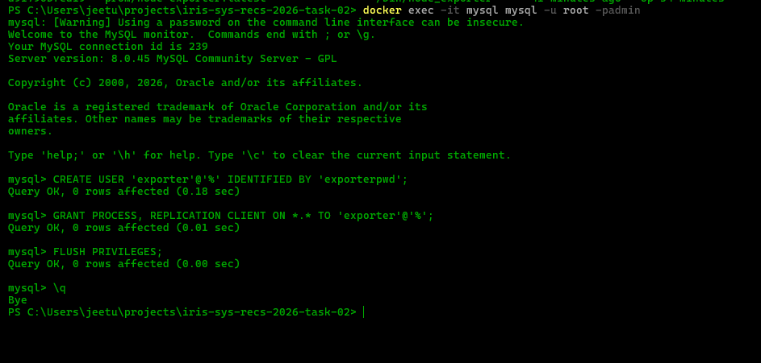

-`mysld_exporter.cnf.example` as the config file example for mysqld-exporter

## Screenshots

- Below are screenshots from the project:


### 1. Docker Containers Running

- Running the docker files.

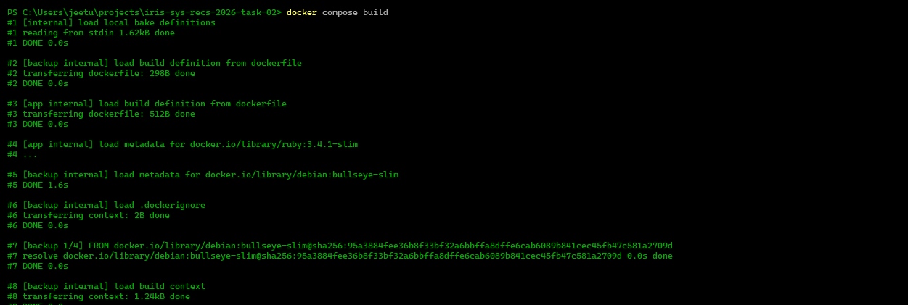

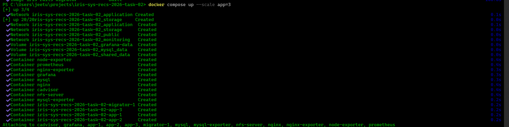

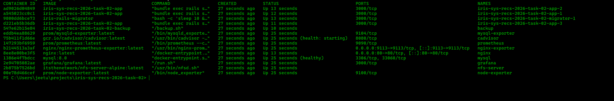

---

### 2. Prometheus Targets and metrics

- **Note** : The metrics endpoint at app:3000/metrics is showing as down because it was being blocked by the host. Although the metrics are being scraped, they are not successfully reaching Prometheus.

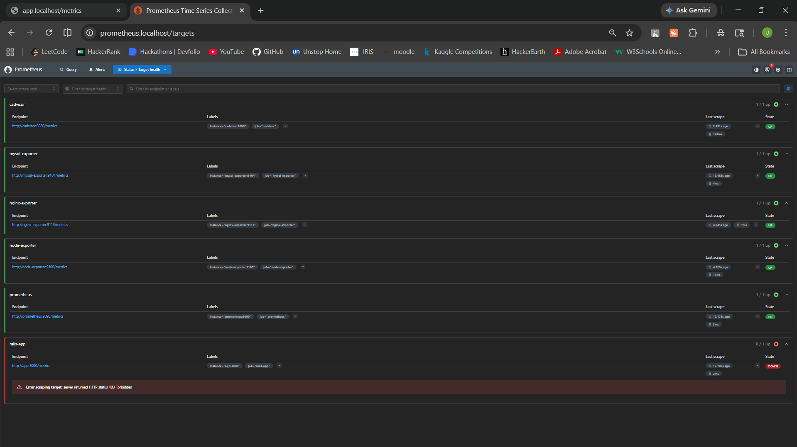

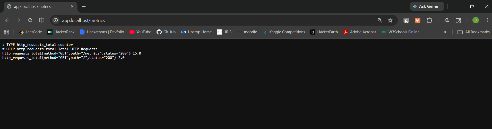

---


### 3. Grafana Screenshots

- All Metrics that are beingin scraped

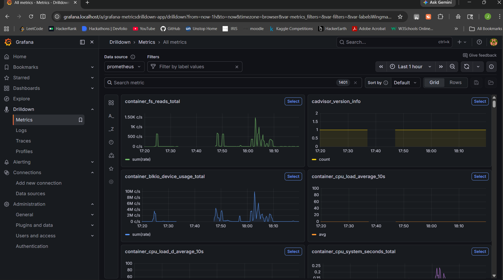

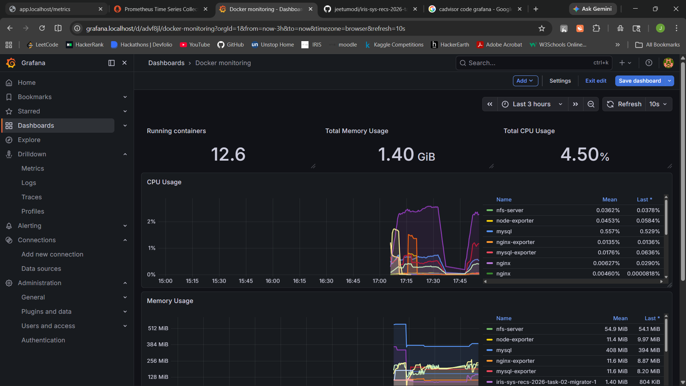

- Memory, CPU, and container restart metrics (request rate and error rate are not included because Prometheus was blocked from accessing app:3000/metrics)
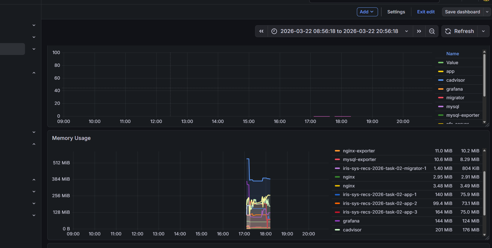

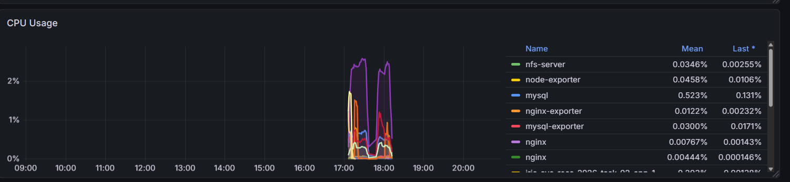

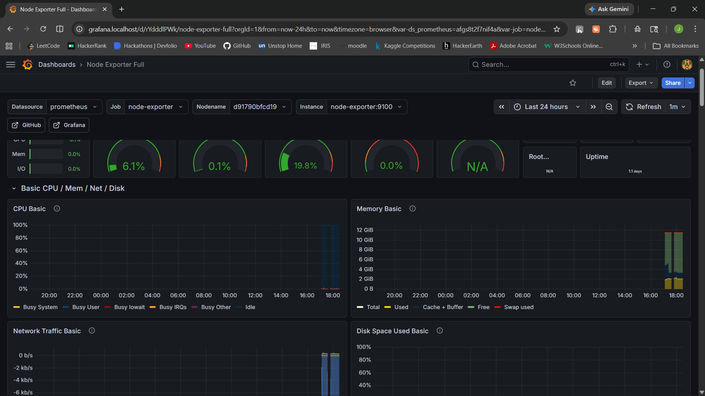


---


## Notes
- Each screenshot is referenced by its filename in the `screenshots` directory.


