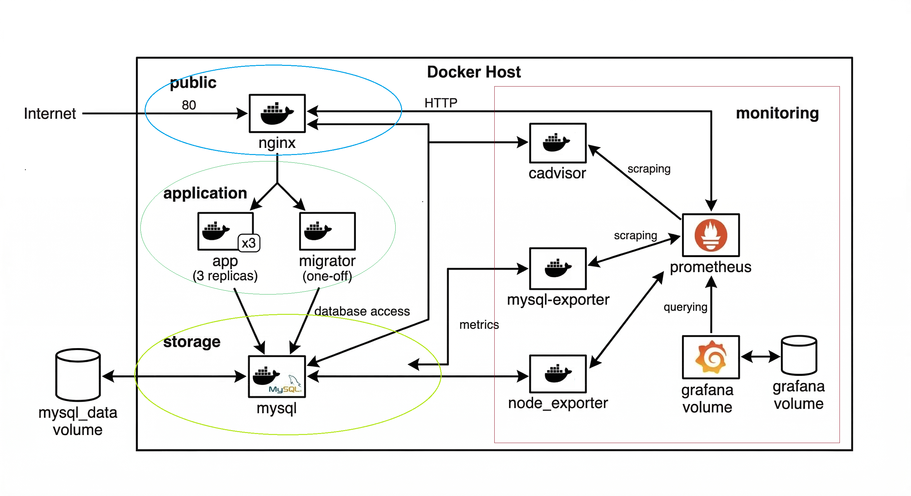
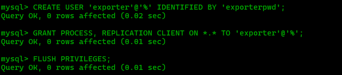
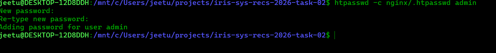
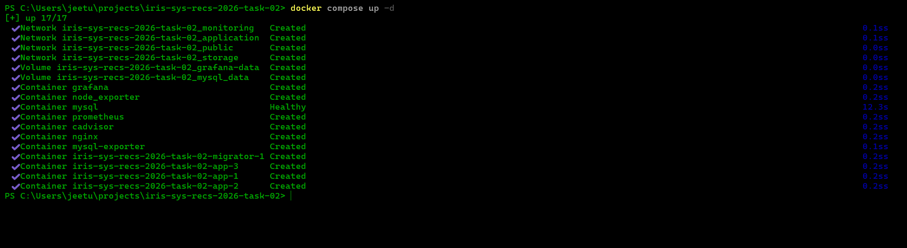
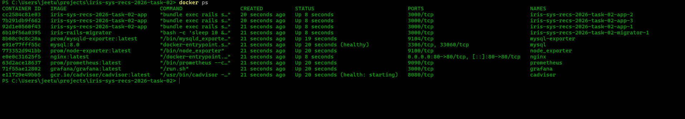
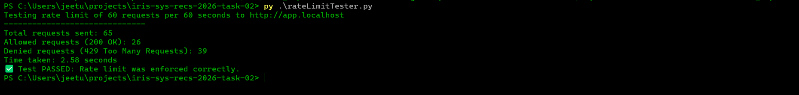
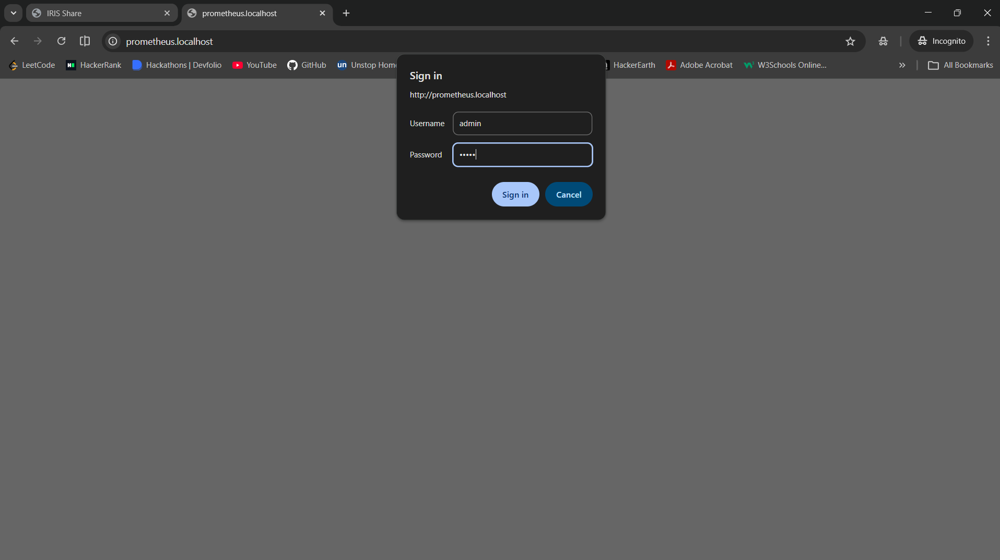
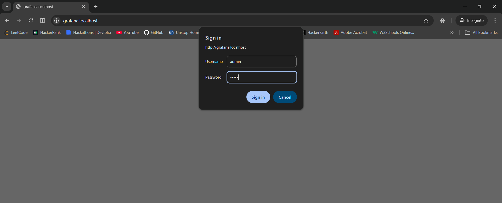
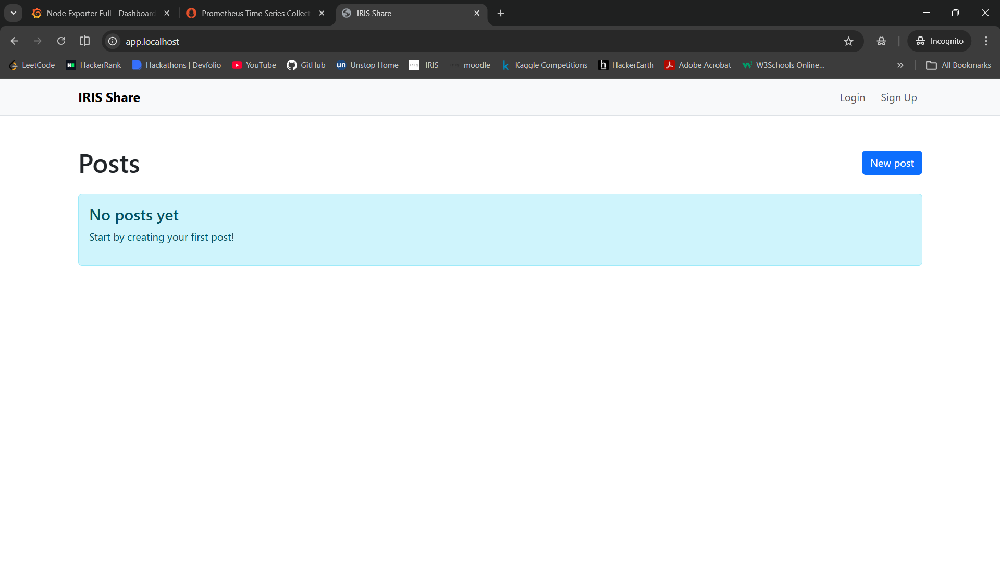
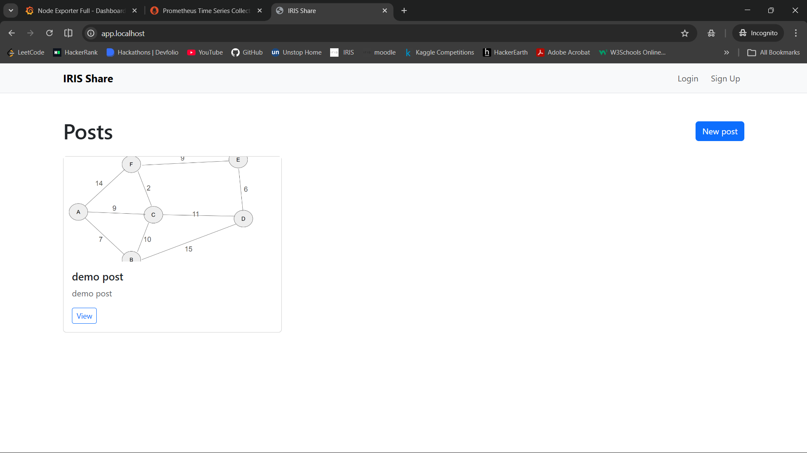

# TASK 01 Nginx Setup

## Project Overview

### Dockerfile content
 
- The application is containerized using Docker with a Ruby 3.4.1 slim image.
- The Dockerfile installs MySQL client dependencies
- Then copies your Gemfile, runs `bundle install`.
- Finally exposes port 3000 for the Rails server.

## Issues and fixes

- **Database migrations when scaling:**
	- Problem: When running 3 replicas, login failed due to CSRF errors. This happened because session cookies and tokens were not shared across the replicas.

    - Fix: Implemented sticky sessions, so each client IP is consistently routed to the same server. If that server goes down, the requests from that IP are automatically redirected to another available server.

## Network structure


- `public` : This networks allows the nginx to compunicate with the outside.
- `monitoring`: This network has cadvisor, node-exporter, mysqld-exporter, prometheus and grfana. Which are used for monitoring.
- `application`: This network is for application for `app` and `migrator` which cannot directly be acessed it has to go through nginx only.As it has to go through nginx we can implement ratelimit and other central policies
- `storage`: This is for mysql storage this would be help full for prevent the direct access from nginx to database. It can only be access by `app` and `migrator`

## create a user for exporter
```
CREATE USER 'exporter'@'%' IDENTIFIED BY 'exporter-password';
GRANT PROCESS, REPLICATION CLIENT ON *.* TO 'exporter'@'%';
FLUSH PRIVILEGES;
```
- Screenshot of creating user:



-`mysld_exporter.cnf.example` as the config file example for mysqld-exporter

## Screenshots

- Below are screenshots from the project:

`Nginx and prometheus and other screenshots`
---

### 1. Creating admin password for Prometheus/Grafana



---

### 2. MySQL Exporter User Setup


---

### 3. Docker Compose Up



---

### 4. Docker Containers Running



---

### 5. Rate Limit Tester



---

### 6. Prometheus Login



---

### 7. Prometheus Targets


---

### 8. Grafana Login



---

### 9. Grafana Metrics Drilldown


---

### 10. Grafana Dashboards


---

### 11. IRIS Share App - 1



---

### 12. IRIS Share App - 2




## Notes
- Each screenshot is referenced by its filename in the `screenshots` directory.


