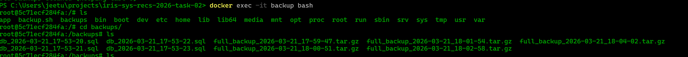

# TASK 04 Backup setup

## Project Overview

### Dockerfile content
 
- The application is containerized using Docker with a Ruby 3.4.1 slim image.
- The Dockerfile installs MySQL client dependencies
- Then copies your Gemfile, runs `bundle install`.
- Finally exposes port 3000 for the Rails server.

## Note
- In this currently the data is stored in a local volume this.(it would be better if it is done in in the cloud i.e saving the files to the cloud for more safety ).

## Screenshots

- Below are screenshots from the project:
\

-  backup working proof

## Notes
- Each screenshot is referenced by its filename in the `screenshots` directory.

