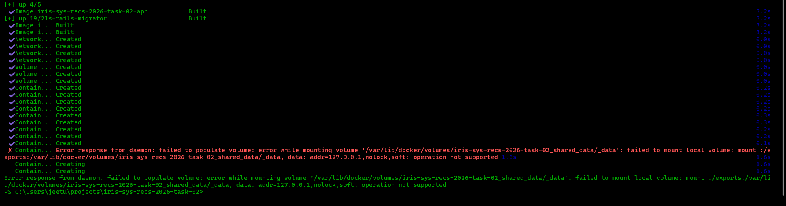
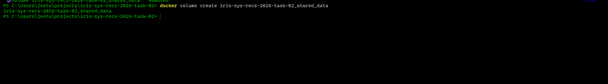
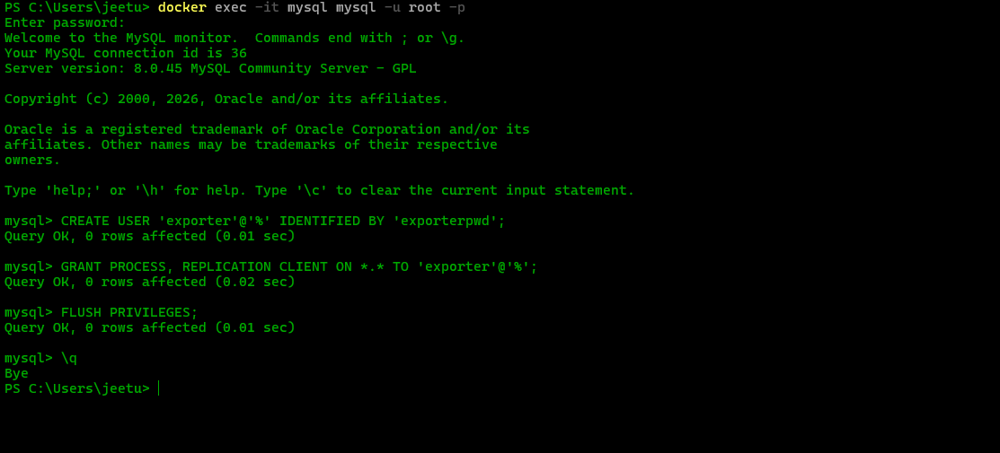
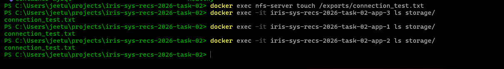
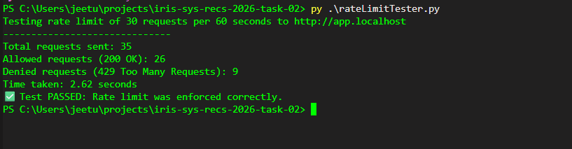
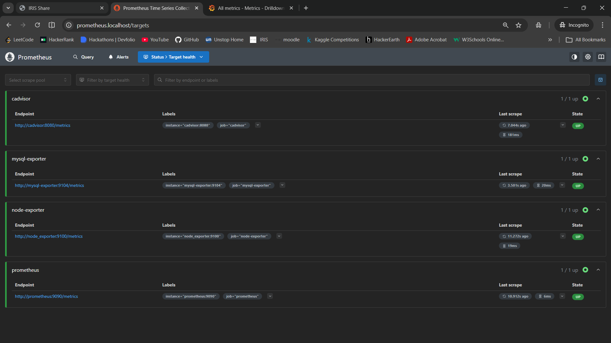
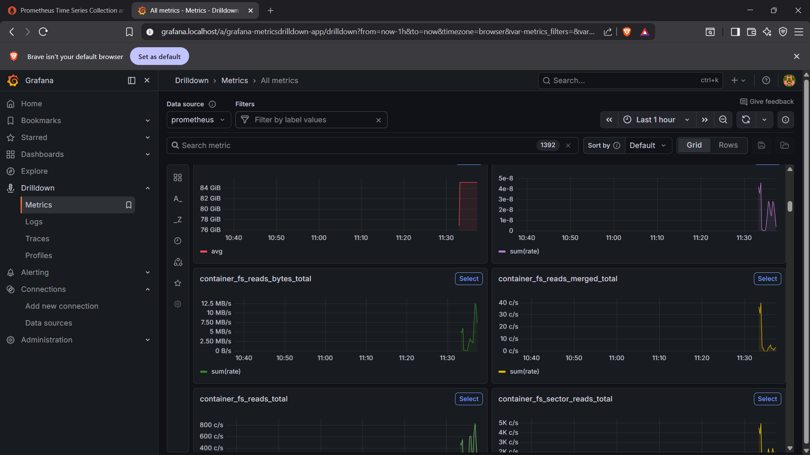
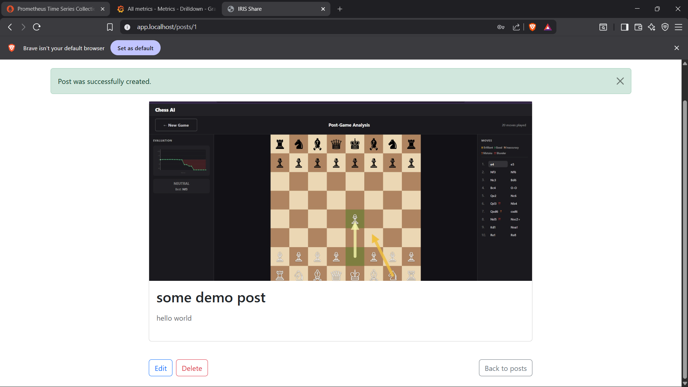

# TASK 02 NFS-server setup/ data persistence

## Project Overview

### Dockerfile content
 
- The application is containerized using Docker with a Ruby 3.4.1 slim image.
- The Dockerfile installs MySQL client dependencies
- Then copies your Gemfile, runs `bundle install`.
- Finally exposes port 3000 for the Rails server.

## Issues and fixes

- **Authentication error:**
	- Problem: When running 3 replicas, login failed due to CSRF errors. This happened because session cookies and tokens were not shared across the replicas. And sometimes the request was going to only one conatiner.

    - (New) Fix: I added a secrect_key_base to the environments to fix this issue(without this 3 replicas that we create we having different keys) for that reason I was getting this error as by default rails uses this key to encrypt session data in cookies on the users broswer.

    - Fix 2: i changed the load balancing method from default round robin to least count which makes more sense then round robin for load balancing. Now requests we going properly

    
- **NFS-SERVER ERROR**
    - Issue: There was some kind of mounting error because first volumes are created but driver-opts was needing nfs-server but that would be created after volumes are created so this error was result of this conflict.
    
    - Fix: I created a normal voulme without the driver-opts and tested the connections it was working correctly and also later i commented out this driver-opts.
    
    

## create a user for exporter
```
CREATE USER 'exporter'@'%' IDENTIFIED BY 'exporter-password';
GRANT PROCESS, REPLICATION CLIENT ON *.* TO 'exporter'@'%';
FLUSH PRIVILEGES;
```
- Screenshot of creating user:



-`mysld_exporter.cnf.example` as the config file example for mysqld-exporter

## Screenshots

- Below are screenshots from the project:

**Persistence proof**
---
### 1. Connection test and persistence test


---
- create a file in one container it should replicat in all three

- Proof that it does in all the 3

---

### 1. Docker Containers Running


---

### 2. Rate Limit Tester



---


### 3. Prometheus Targets



---


### 4. Grafana Metrics Drilldown



---


### 5. IRIS Share App - 1



---

### 6. IRIS Share App - 2


## Notes
- Each screenshot is referenced by its filename in the `screenshots` directory.


